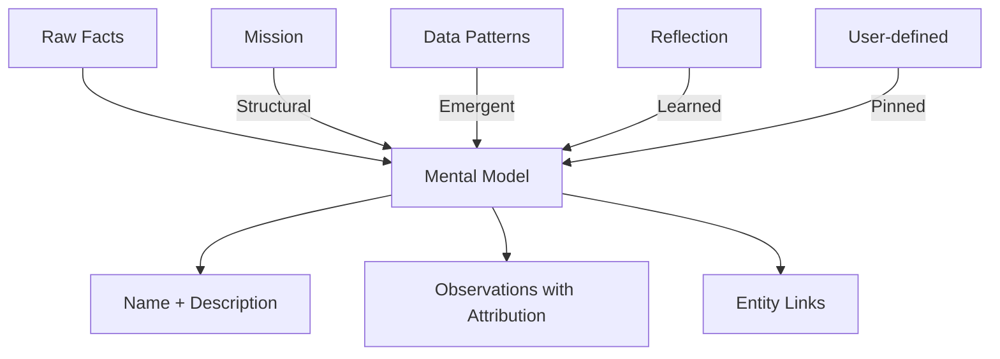
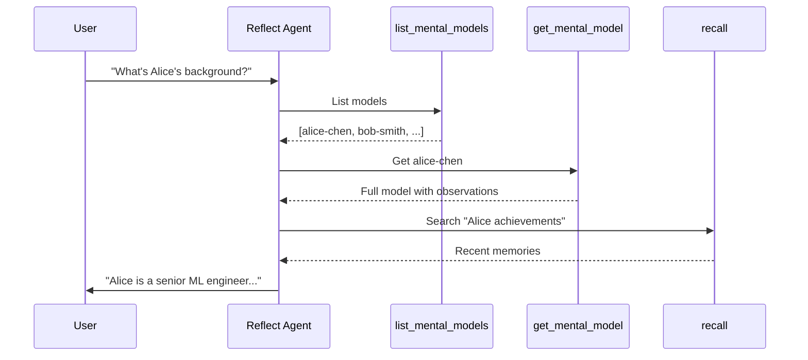

# Mental Models: Synthesized Knowledge

Mental models are Hindsight's way of organizing **synthesized knowledge** — consolidated understanding about entities, concepts, and events that goes beyond raw facts. Think of them as the agent's "working knowledge" about important topics.



---

## Why Mental Models?

Facts alone don't scale. When your memory bank contains thousands of facts about a person, project, or concept, you need a way to:

1. **Summarize**: Get the essential understanding without reading every fact
2. **Quick Access**: Answer questions like "Who is Alice?" without searching all facts
3. **Evolve Understanding**: Update knowledge as new information arrives
4. **Connect Concepts**: Link related mental models together

### The Problem Without Mental Models

```
Query: "Tell me about Alice"

Without mental models:
→ Search all 847 facts mentioning "Alice"
→ Process each fact to extract relevant information
→ Synthesize on-the-fly every single time
→ Slow, expensive, inconsistent
```

### The Solution With Mental Models

```
Query: "Tell me about Alice"

With mental models:
→ Lookup mental model "alice" (entity)
→ Get pre-synthesized summary instantly
→ Fast, cheap, consistent
```

---

## Mental Model Structure

Each mental model contains:

| Field | Description |
|-------|-------------|
| **id** | Stable identifier (derived from name, e.g., "alice", "pinned-product-roadmap") |
| **name** | Human-readable name ("Alice Chen", "React Migration") |
| **subtype** | How it was created: `structural`, `emergent`, `learned`, or `pinned` |
| **description** | One-liner for quick scanning and retrieval matching |
| **observations** | Structured content with per-observation memory attribution |
| **entity_id** | Optional link to entities table |
| **tags** | For scoped visibility filtering |

### Observations Structure

Mental model content is organized into **observations**, each with supporting memory references:

```json
{
  "observations": [
    {
      "title": "",
      "text": "Alice Chen is a senior ML engineer who joined from Google in 2023.",
      "based_on": ["uuid-1", "uuid-2"]
    },
    {
      "title": "Key Achievements",
      "text": "Led the personalization project that improved engagement by 23%.",
      "based_on": ["uuid-3"]
    }
  ]
}
```

This structure enables:
- **Per-observation attribution**: Know exactly which memories support each claim
- **Incremental updates**: New observations can be added without regenerating everything
- **Transparency**: Users can trace any statement back to source memories

### Example Mental Model

```json
{
  "id": "alice-chen",
  "name": "Alice Chen",
  "subtype": "emergent",
  "description": "Senior ML engineer, recommendation systems expert",
  "observations": [
    {
      "title": "",
      "text": "Alice Chen is a senior machine learning engineer who joined from Google in 2023.",
      "based_on": ["550e8400-e29b-41d4-a716-446655440000"]
    },
    {
      "title": "Expertise",
      "text": "Specializes in recommendation systems. Led the personalization project that improved engagement by 23%.",
      "based_on": ["550e8400-e29b-41d4-a716-446655440001", "550e8400-e29b-41d4-a716-446655440002"]
    },
    {
      "title": "Leadership",
      "text": "Known for strong technical mentorship. Has helped onboard 5 new engineers.",
      "based_on": ["550e8400-e29b-41d4-a716-446655440003"]
    }
  ],
  "entity_id": "550e8400-e29b-41d4-a716-446655440000",
  "tags": ["engineering", "ml-team"]
}
```

---

## Types and Subtypes

### Types (What It Represents)

| Type | Description | Examples |
|------|-------------|----------|
| **entity** | People, organizations, systems, places | "Alice Chen", "Google", "Auth Service", "NYC Office" |
| **concept** | Abstract ideas, processes, patterns | "React Migration", "CI/CD Pipeline", "Code Review Process" |
| **event** | Specific occurrences or series | "Q3 2024 Incident", "Product Launch", "Team Offsite" |

### Subtypes (How It Was Created)

Mental models are created through four distinct paths:

#### Structural Models

Derived from the bank's **mission**. These represent what any agent with this role would need to track.

```
Mission: "Be a PM for the engineering team"
     ↓
Structural models:
  - Team Members (who's on the team)
  - Sprint Goals (current objectives)
  - Key Decisions (important choices made)
```

**Characteristics:**
- Created when you set a bank's mission via the profile
- Maximum 3 per bank (to stay focused)
- Must be specific and actionable, not generic
- Re-evaluated when mission changes

#### Emergent Models

Discovered from **data patterns** — entities that appear frequently in your facts.

```
Facts mentioning "Alice" → 47 times
Facts mentioning "Bob" → 32 times
Facts mentioning "React" → 28 times
     ↓
Emergent candidates detected
     ↓
Goal filter: "Is this a specific named entity?"
     ↓
Emergent models created: "Alice", "Bob", "React"
```

**Characteristics:**
- Auto-detected from entity extraction
- Filtered to only include specific named entities (not generic words)
- Must meet minimum mention threshold (default: 5)
- Must be in top 20% by frequency

**Filter Rules (what gets promoted):**
- Person names: "John", "Maria", "Alice Chen"
- Named organizations: "Google", "Acme Corp", "Frontend Team"
- Named places: "Central Park Zoo", "NYC Office"
- Named projects: "Project Phoenix", "Auth Service v2"

**What gets rejected:**
- Generic words: "user", "team", "family", "community"
- Abstract concepts: "motivation", "collaboration", "growth"
- Common categories: "customers", "employees"

#### Learned Models

Formed through **reflection**. When the reflect agent discovers a topic worth remembering, it creates a learned model placeholder.

```python
# During reflect(), agent calls:
learn(
    name="Kubernetes Strategy",
    description="Container orchestration approach - track migration timeline, rationale, and implementation details"
)
```

**How learned models get content:**
1. Agent creates placeholder with name + description during reflect
2. During next `refresh`, the system uses the description as a prompt
3. Relevant facts are gathered and synthesized into observations
4. Observations are stored with per-observation fact attribution

**Characteristics:**
- Created by reflect agent's `learn` tool
- Placeholder until refresh populates content
- Content generated with structured observations and fact attribution
- Persist across conversations

#### Pinned Models

**User-defined** mental models that you create directly via the API. Unlike other subtypes, pinned models persist across refresh operations.

```python
# Create a pinned mental model
client.create_mental_model(
    bank_id="my-bank",
    name="Product Roadmap",
    description="Key product priorities and upcoming features",
    tags=["product"]
)
```

**Characteristics:**
- Created via `POST /mental-models` endpoint
- User-controlled — you define exactly what to track
- **Persist across refreshes** — not removed during regeneration
- ID format: `pinned-{normalized-name}`
- No automatic summary generation (description serves as the content)

**When to use pinned models:**
- Track topics that won't emerge from data patterns
- Define important concepts before accumulating facts
- Create placeholders for knowledge you expect to gather
- Ensure specific topics are always available for lookup

---

## Creating and Managing Mental Models

### Creating Pinned Models

Create user-defined mental models that persist across refreshes:

```bash
curl -X POST "http://localhost:8000/v1/default/banks/my-bank/mental-models" \
  -H "Content-Type: application/json" \
  -d '{
    "name": "Product Roadmap",
    "description": "Key product priorities and upcoming features",
    "tags": ["product"]
  }'
```

**Response:**
```json
{
  "id": "pinned-product-roadmap",
  "name": "Product Roadmap",
  "type": "concept",
  "subtype": "pinned",
  "description": "Key product priorities and upcoming features",
  "tags": ["product"]
}
```

### Setting a Mission (Structural Models)

Set the bank's mission via the profile to enable structural model derivation:

```bash
curl -X PUT "http://localhost:8000/v1/default/banks/my-bank/profile" \
  -H "Content-Type: application/json" \
  -d '{
    "mission": "Be a technical lead for the mobile app team"
  }'
```

When you refresh mental models, the LLM identifies what's important to track based on the mission:
- Team Members
- Sprint Goals
- Technical Decisions

### Refreshing Mental Models

```bash
curl -X POST "http://localhost:8000/v1/default/banks/my-bank/mental-models/refresh" \
  -H "Content-Type: application/json"
```

This async operation:
1. Re-derives structural models from mission
2. Detects emergent candidates from entities
3. Filters candidates to specific named entities
4. Generates/updates observations for all models

**Response:**
```json
{
  "operation_id": "550e8400-e29b-41d4-a716-446655440000",
  "message": "Refresh operation submitted"
}
```

### Listing Mental Models

```bash
# List all
curl "http://localhost:8000/v1/default/banks/my-bank/mental-models"

# Filter by subtype
curl "http://localhost:8000/v1/default/banks/my-bank/mental-models?subtype=emergent"

# Filter by type
curl "http://localhost:8000/v1/default/banks/my-bank/mental-models?type=entity"

# Filter by tags
curl "http://localhost:8000/v1/default/banks/my-bank/mental-models?tags=engineering,ml-team&tags_match=any"
```

### Getting a Specific Model

```bash
curl "http://localhost:8000/v1/default/banks/my-bank/mental-models/alice-chen"
```

### Deleting a Model

```bash
curl -X DELETE "http://localhost:8000/v1/default/banks/my-bank/mental-models/alice-chen"
```

---

## Research: Querying Mental Models

The research endpoint provides an **agentic query interface** to mental models:

```bash
curl -X POST "http://localhost:8000/v1/default/banks/my-bank/research" \
  -H "Content-Type: application/json" \
  -d '{
    "query": "Who are the key people on the ML team?"
  }'
```

**How It Works:**

1. Agent sees available mental models (names + descriptions)
2. Agent decides which models to fetch (`get_mental_model`)
3. Agent can search additional facts (`recall`)
4. Agent synthesizes final answer

**Response:**
```json
{
  "answer": "The key people on the ML team are Alice Chen (senior engineer, leads recommendations), Bob Smith (data engineer, maintains pipelines), and Carol Wang (ML ops, handles deployment).",
  "mental_models_used": ["alice-chen", "bob-smith", "carol-wang"],
  "facts_used": ["ml team roster updated Q4", "alice promoted to senior"]
}
```

---

## Mental Models in Reflect

The [reflect agent](./reflect) uses mental models extensively:

### list_mental_models / get_mental_model Tools

Lists all mental models or gets a specific one:

```python
# List all (for agent to see what's available)
list_mental_models()  # Returns name + description for all models

# Get specific model
get_mental_model(model_id="alice-chen")  # Returns full details including observations
```

### learn Tool

Creates a placeholder mental model that gets populated during refresh:

```python
learn(
    name="Sprint 23 Retrospective",
    description="Key outcomes from sprint 23 review - track wins, issues, and action items"
)
```

The agent only provides name and description. The actual content (observations with memory attribution) is generated during the next `refresh` operation.

### Integration Flow



---

## Content Generation

Mental model content (observations) is generated using the reflect agent:

1. Model name and description are used as the query
2. Agent explores memories related to the entity/concept
3. Agent synthesizes structured observations with memory attribution
4. Observations are stored with `last_updated` timestamp

**Trigger:** Content is generated during `refresh` operations or via the `/mental-models/{model_id}/generate` endpoint.

**Quality:** All content is grounded in actual memories — the agent cannot hallucinate information not present in the memory bank.

---

## Best Practices

### Mission Design

Write specific, actionable missions:

```
# Good
"Track customer feedback and feature requests for the mobile app"
"Be a technical lead for the backend team"
"Monitor project milestones for Q1 launch"

# Bad (too vague)
"Help with work"
"Know things about the team"
"Remember important stuff"
```

### When to Refresh

Trigger refresh when:
- Significant new data has been retained
- Mission has changed
- You notice stale or missing mental models

### Tag Organization

Use tags to organize mental models by domain:

```python
# During refresh, new models get these tags
refresh_mental_models(tags=["engineering", "q1-2025"])

# Query scoped mental models
list_mental_models(tags=["engineering"])
research(query="Who leads infrastructure?", tags=["engineering"])
```

---

## Database Schema

Mental models are stored in the `mental_models` table:

```sql
CREATE TABLE mental_models (
    id VARCHAR(64) NOT NULL,           -- Stable ID from name
    bank_id VARCHAR(64) NOT NULL,      -- Isolation by bank
    subtype VARCHAR(32) NOT NULL,       -- structural, emergent, learned, pinned
    name VARCHAR(256) NOT NULL,
    description TEXT NOT NULL,
    observations JSONB,                 -- Structured content [{title, text, based_on}]
    entity_id UUID,                     -- Link to entities table
    links VARCHAR[],                   -- Related model IDs
    tags VARCHAR[] DEFAULT '{}',
    last_updated TIMESTAMP WITH TIME ZONE,
    created_at TIMESTAMP WITH TIME ZONE NOT NULL DEFAULT now(),
    PRIMARY KEY (id, bank_id)
);
```

**Indexes:**
- `bank_id` for efficient bank queries
- `bank_id + subtype` for subtype filtering
- `entity_id` for entity lookups
- `tags` (GIN) for efficient array filtering

---

## API Reference

| Method | Endpoint | Description |
|--------|----------|-------------|
| **POST** | `/v1/default/banks/{bank_id}/mental-models` | Create pinned model |
| **GET** | `/v1/default/banks/{bank_id}/mental-models` | List mental models |
| **GET** | `/v1/default/banks/{bank_id}/mental-models/{model_id}` | Get specific model |
| **POST** | `/v1/default/banks/{bank_id}/mental-models/refresh` | Refresh all models (async) |
| **POST** | `/v1/default/banks/{bank_id}/mental-models/{model_id}/generate` | Generate content for a model (async) |
| **DELETE** | `/v1/default/banks/{bank_id}/mental-models/{model_id}` | Delete a model |
| **POST** | `/v1/default/banks/{bank_id}/research` | Query mental models |

---

## Next Steps

- [**Reflect**](./reflect) — How the agentic reflect uses mental models
- [**Retain**](./retain) — How facts are stored (feeding into emergent detection)
- [**Entities**](./api/entities) — The entity system that feeds emergent models
