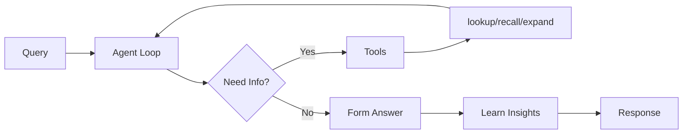

# Reflect: Agentic Reasoning with Disposition

When you call `reflect()`, Hindsight launches an **agentic loop** that reasons about your question through the lens of the bank's unique disposition, dynamically gathering information and forming insights.

---

## How It Works

Unlike traditional RAG systems that pre-retrieve context, the reflect agent **actively explores** your memory bank. It:

1. **Iterates** up to 10 times to gather information
2. **Decides** which tools to call at each step (lookup, recall, expand, learn)
3. **Synthesizes** and reasons from retrieved data — making inferences when helpful
4. **Completes** with a structured answer grounded in facts

The agent is a thoughtful interpreter, not just a literal fact repeater. It connects related facts, makes reasonable inferences, and provides the best possible answer from available data.

---

## Why Reflect?

Most AI systems retrieve facts but can't **reason** about them consistently. Every response is generated fresh without a stable perspective.

| Without Reflect | With Reflect |
|-----------------|--------------|
| No consistent character | Disposition-shaped responses |
| No opinion formation | Beliefs evolve with evidence |
| Generic responses | Differentiated behavior |
| Same answer every time | Context-aware reasoning |

### When to Use Reflect vs Recall

| Use `recall()` when... | Use `reflect()` when... |
|------------------------|-------------------------|
| You need raw facts | You need reasoned interpretation |
| You're building your own reasoning | You want the bank to "think" for itself |
| Simple fact lookup | Forming recommendations or opinions |

---

## Disposition Traits

Banks have three disposition traits that shape how reflect interprets information:

| Trait | Low (1) | High (5) |
|-------|---------|----------|
| **Skepticism** | Trusting, accepts claims | Questions and doubts claims |
| **Literalism** | Flexible interpretation | Exact, literal interpretation |
| **Empathy** | Detached, fact-focused | Considers emotional context |

### Same Facts, Different Conclusions

Two banks with different dispositions, given identical facts about remote work:

**Bank A** (low skepticism, high empathy):
> "Remote work enables flexibility and work-life balance. The team seems happier and more productive."

**Bank B** (high skepticism, low empathy):
> "Remote work claims need verification. What are the actual productivity metrics?"

---

## Mental Models Integration

The reflect agent works with [Mental Models](./mental-models) — synthesized knowledge that persists across conversations.

- **lookup**: Retrieve existing mental models for quick context
- **learn**: Create new mental models when discovering insights worth remembering

Mental models provide "what the agent already knows" before searching facts, enabling faster and more informed responses.

---

## Disposition Presets

| Use Case | Traits | Character |
|----------|--------|-----------|
| **Customer Support** | skepticism: 2, empathy: 5 | Trusting, understanding |
| **Code Review** | skepticism: 4, literalism: 5 | Questions assumptions, precise |
| **Legal Analysis** | skepticism: 5, literalism: 5 | Highly skeptical, exact |
| **Research Assistant** | skepticism: 4, empathy: 3 | Questions claims, balanced |

---

## Next Steps

- [**API Reference: Reflect**](./api/reflect) — Parameters, examples, and response format
- [**Mental Models**](./mental-models) — How synthesized knowledge is organized
- [**Recall**](./retrieval) — Direct fact retrieval without reasoning
